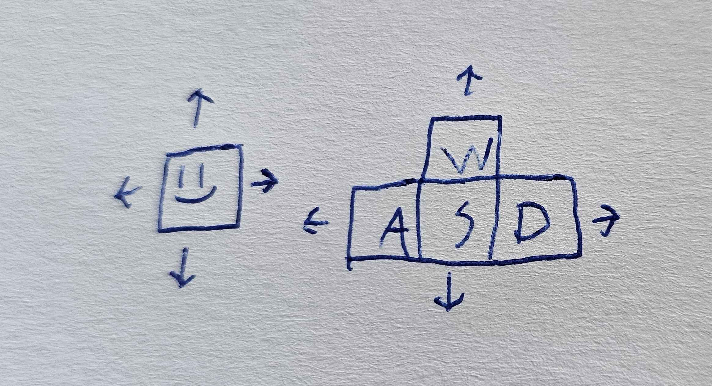
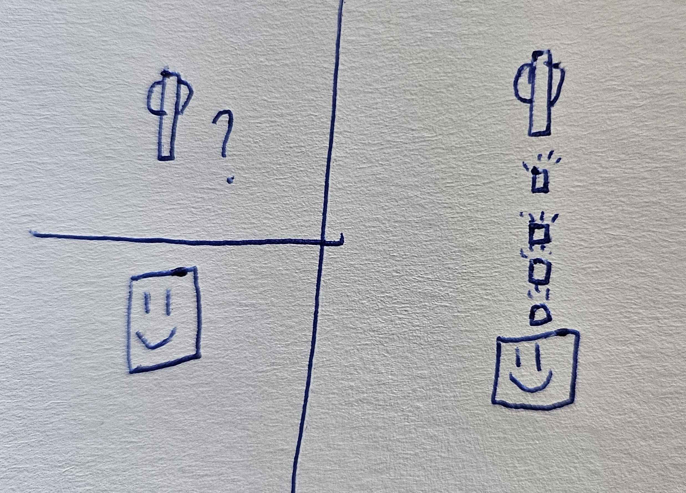
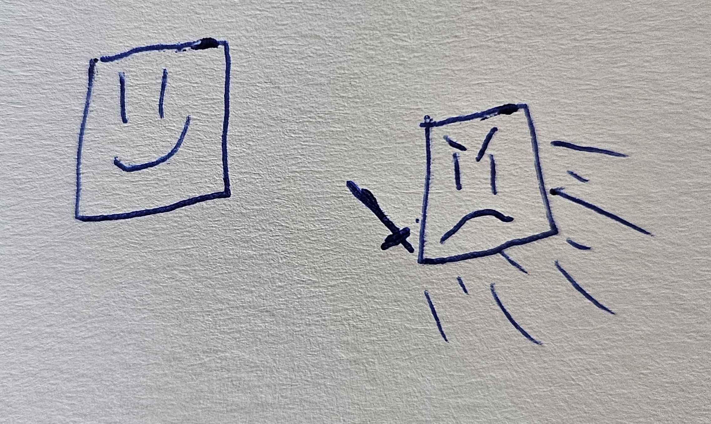
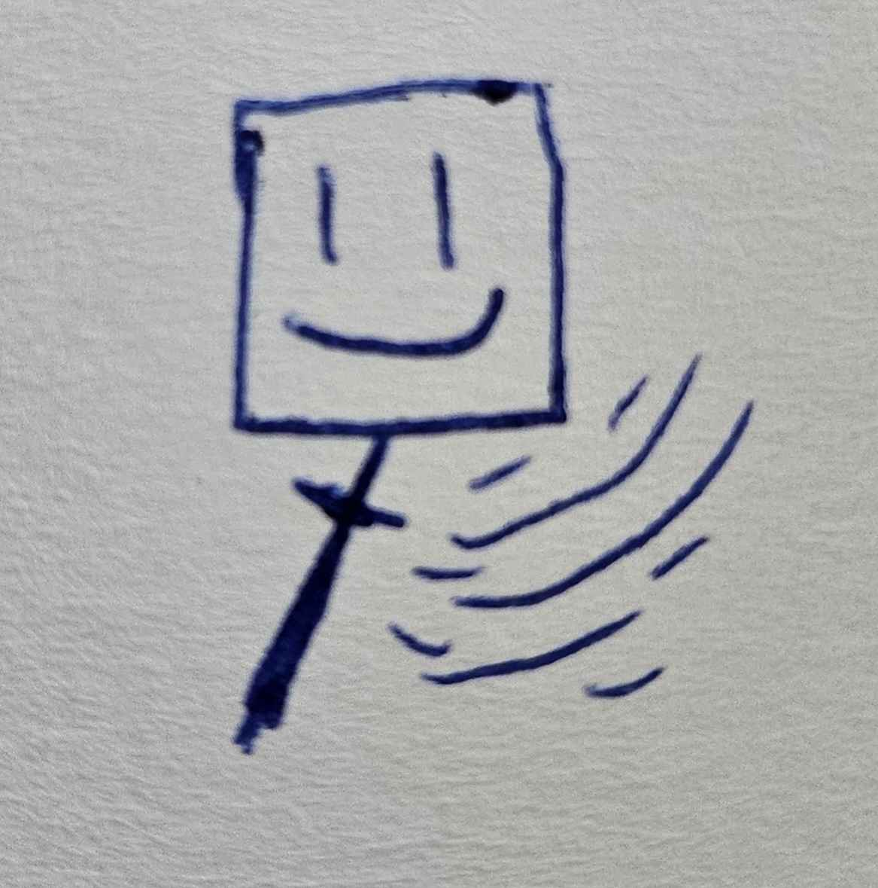
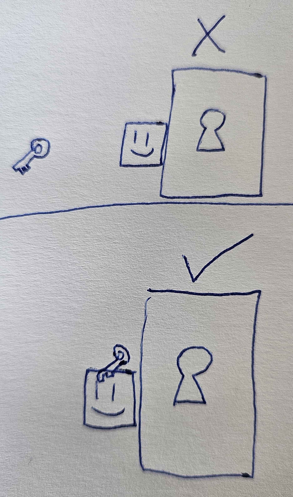
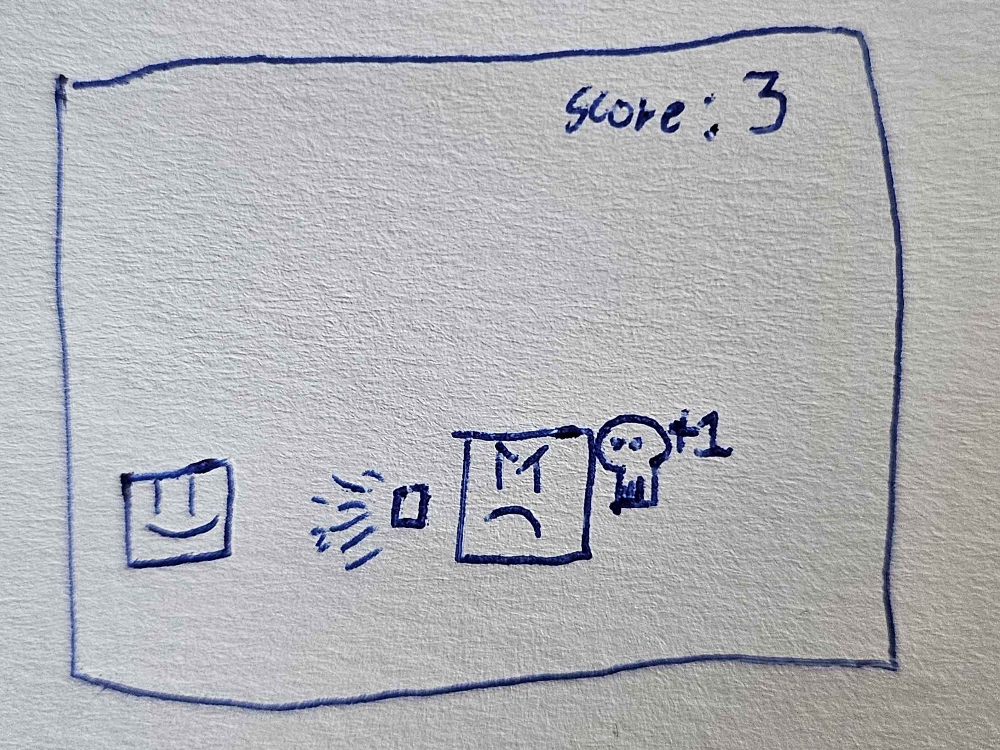
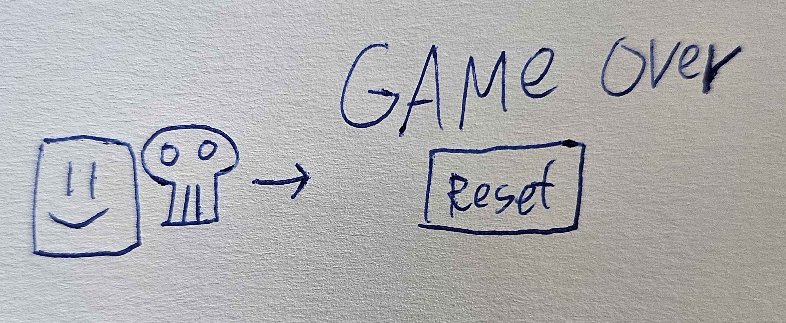

# Functional Design Document (FDD)

## General description
This will be a 2D topdown shooter game. This game is an assignment for Specialization.

## Functional requirements
* The player will move up, down, left, right with the WSAD keys.

* The player can shoot a projectile by clicking. The player looks at the cursor and the bullets fly towards the cursor position.

* Bullets should be destroyed on collision and should deal damage to enemies and breakable objects.

* There should be a turret that only shoots at the player if it can see the player.

* There should be an enemy that runs towards the player and deals damage by touching.

* The player can do an area of effect melee attack.

* There should be a locked door that the player can open by collecting a key and touching the door.

* Each enemy killed should display score on screen.

* There should be simple sound effects.

* Enemies can damage the player. If the player is out of health, he dies and the game resets.

## Non-functional requirements

### Performance
* The game should not lag or reduce below 60 frames per second, even while the player and enemies are shooting.

### Security
* Not relevant.