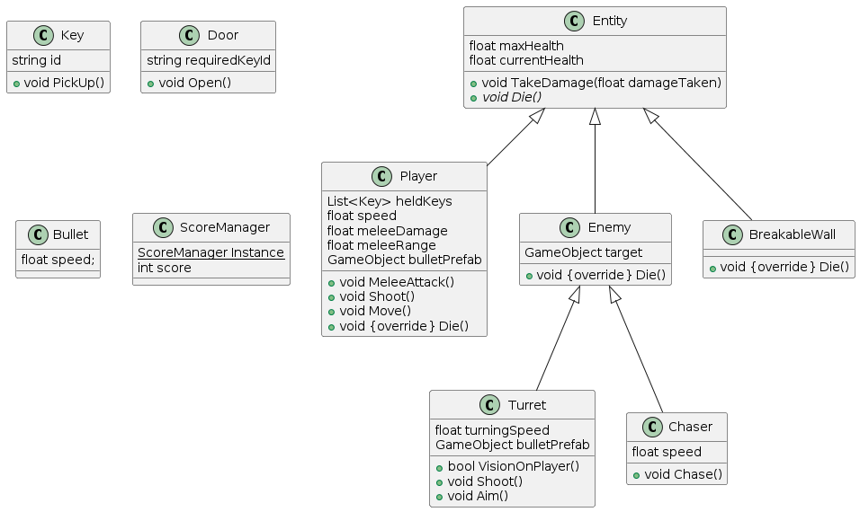

# Technical Design Document (TDD)

## Class diagram

## Functionalities
* The player will move up, down, left, right with the WSAD keys.
  * Input will be handled by Unity's new Input System. This should be enabled through the project settings.
    (https://docs.unity3d.com/Packages/com.unity.inputsystem@1.8/manual/Installation.html)
* The player can shoot a projectile by clicking. The player looks at the cursor and the bullets fly towards the cursor position.
  * The bullets will spawn by instantiating a bullet prefab.
  * The input system will track the mouse position.
  * The player will rotate towards the mouse position.
    (https://www.youtube.com/watch?v=Geb_PnF1wOk)
* Bullets should be destroyed on collision and should deal damage to enemies and breakable objects.
  * The collider of the bullet should be set it "Is Trigger".
  * The damage and destroying should be handled through OnTriggerEnter2D()
* There should be a turret that only shoots at the player if it can see the player.
  * The turret should detect the player using a RayCast.
* There should be an enemy that runs towards the player and deals damage by touching.
  * The enemy should know the position of the player and run towards it.
  * The enemy does not have to use complex pathfinding to avoid obstacles.
* The player can do an area of effect melee attack.
  * The visual of the attack should be done through a Unity animation.
  * The damage check should be done using an OverlapCircle.
    (https://docs.unity3d.com/ScriptReference/Physics2D.OverlapCircle.html)
* There should be a locked door that the player can open by collecting a key and touching the door.
  * The player should have a list of all keys they have collected.
  * A key should have an ID.
  * Using OnCollisionEnter2D() with the door should be checked if the player has a key with the correct ID for the door.
* Each enemy killed should display score on screen.
  * There should be a score manager which is a Singleton.
  * If an enemy dies it should add one score to the score manager.
    (https://gamedevbeginner.com/singletons-in-unity-the-right-way/)
* There should be simple sound effects.
  * Using audio sources, background music should play.
  * Using audio sources, sound effects should play when taking damage.
* Enemies can damage the player. If the player is out of health, he dies and the game resets.
  * Resetting the game can be done by reloading the scene.
    (https://docs.unity3d.com/ScriptReference/SceneManagement.SceneManager.LoadScene.html)