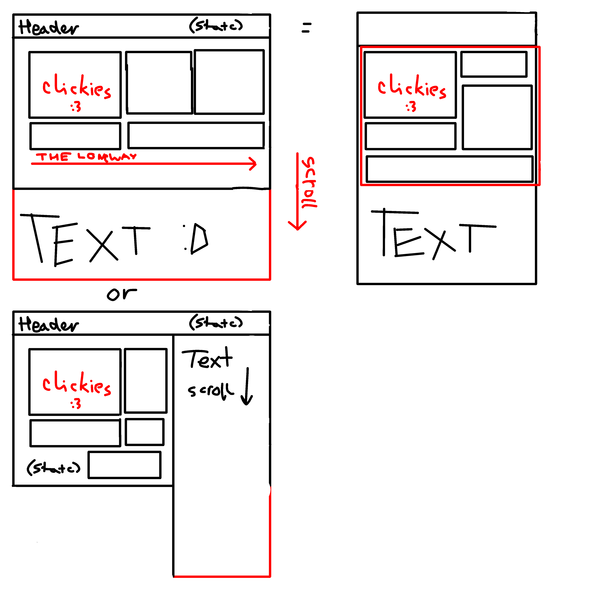

## FDD:

I want to make a responsive mock-up website that will look and function good both in PC and Phone format.\
Main goal here is to learn about responsiveness of a webpage.

**Must have:**

- Responsiveness
- Good UI both on PC and phone (check TDD)
- filler Button(s)
- Filler images
- filler different font Text

**Should have:**

- Favicon

**Could have:**

- Horizontal view for Phone (aka tablet)

**Won't have:**

- Any specific purpose other than to demonstrate responsiveness
- Hardcoded resolutions.

## TDD:

**How to achieve “good” UI:**

I will be following https://www.uidesign.tips/ui-tips this guide for that

**How to achieve responsiveness:**

Instead of hardcoding all the parameters I will be using:

Viewport width/height, Percentages, Flexbox & Grid

**For fillers:**

Elements, images, and text must be used